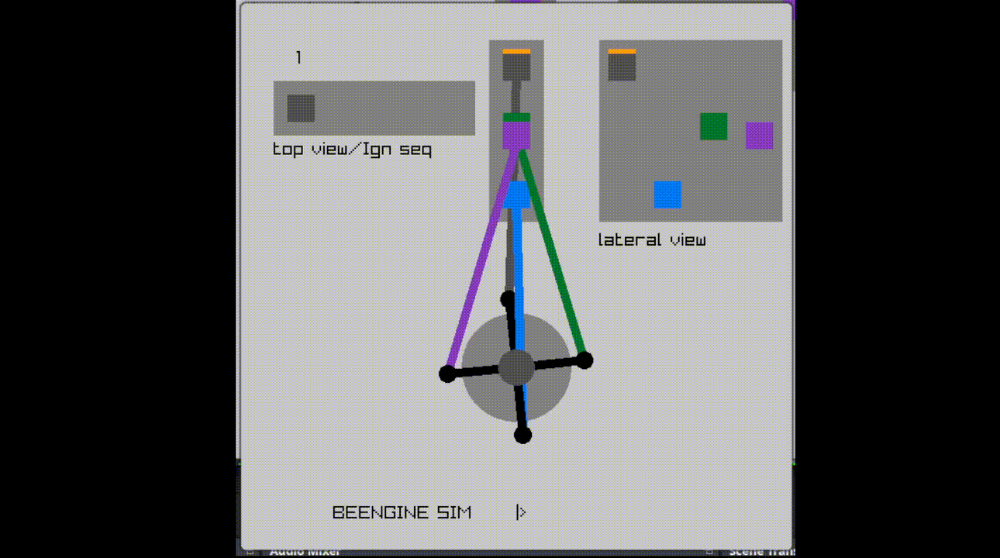

## Simple Inline Engine Simulator

### How to run

 - Execute the run.sh script to run the program.
 - You can tune the settings from the const.h file.

> Note: It only runs when the speed is set to a factor of 150 :'3